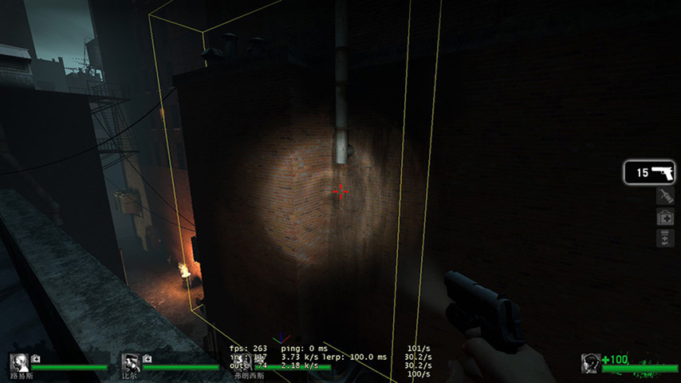

# L4D1地图BUG点修复MapFix
#### 注意本程序需要Stripper:source插件库支持,可下载[SM基础包](https://github.com/ZBzibing/Left4Dead/tree/main/SM%E5%9F%BA%E7%A1%80%E5%8C%85)

本修复原为猎人服的地图修复部分，因完善程度非常高。所以提取出为普通官方地图BUG进行修复。

- 2024-1-4
  - 进行地图修复代码重新整理

## 修复地图目录列表
[毫不留情 No Mercy](#毫不留情-no-mercy)
 [坠机险途 Crash Course](#坠机险途-crash-course)
 [丧亡丧钟 Death Toll](#丧亡丧钟-death-toll)
 [寂静时分 Dead Air](#寂静时分-dead-air)
 [血腥收获 Blood Harvest](#血腥收获-blood-harvest)
 [牺牲 The Sacrifice](#牺牲-the-sacrifice)
 [最后一站 The Last Stand](#最后一站-the-last-stand-survival)

## 毫不留情 No Mercy
### 1. 公寓   The Apartments
- 起点屋顶可以跳楼的捷径修复

### 2. 地铁   The Subway
- 大厦外墙BUG点修复

### 3. 下水道 The Sewer  
- 开机关后，快速往前冲，不刷丧尸和感染者的BUG，需要安装 [机关尸潮修复插件](https://github.comZBzibing)
- 1123123
### 4. 医院   The Hospital
### 5. 屋顶   Rooftop Finale	
## 坠机险途 Crash Course
1. The Alleys
2. The Truck Depot Finale	
## 丧亡丧钟 Death Toll
1. The Turnpike
2. The Drains
3. The Church
4. The Town
5. Boathouse Finale	
## 寂静时分 Dead Air
1. The Greenhouse
2. The Crane
3. The Construction Site
4. The Terminal
5. Runway Finale
## 血腥收获 Blood Harvest
1. The Woods
2. The Tunnel
3. The Bridge
4. The Train Station
5. Farmhouse Finale
## 牺牲 The Sacrifice
1. The Docks
2. The Barge
3. Port Finale
## 最后一站 The Last Stand (Survival)
1. 灯塔 The Lighthouse

<!-- 1. 小巷
2. 卡车库的结局	1. 收费公路
2. 排水沟
3. 教会
4. 镇
5. 船屋结局	1. 温室
2. 起重机
3. 施工现场
4. 终端
5. 跑道结局
血液中的收获
血液中的收获	牺牲
牺牲	最后一站(存活，不要混淆L4D2版本)
最后一站(存活)
1. 树林里
2. 隧道
3. 桥
4. 火车站
5. 农舍的结局	1. 码头
2. 驳船
3. 口结局	灯塔 -->